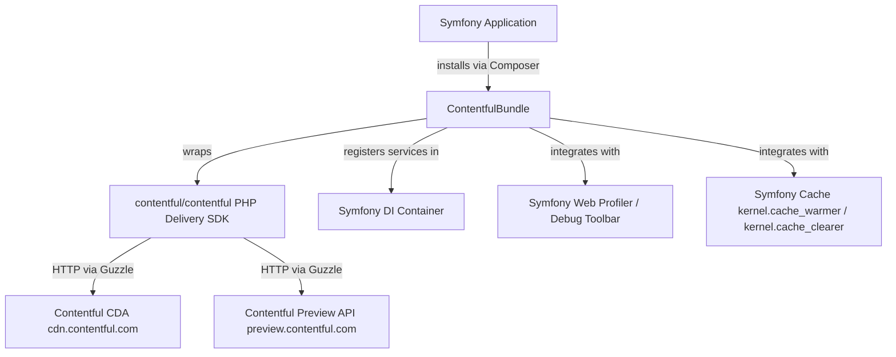

# Architecture

<!-- Generated by seed-golden-context | Last updated: 2026-05-11 -->

## Overview

ContentfulBundle is a Symfony Bundle that integrates the [Contentful PHP Delivery SDK](https://github.com/contentful/contentful.php) (`contentful/contentful`) into any Symfony 5.4/6/7 application. It wires the Contentful Content Delivery API (CDA) and Preview API clients into the Symfony DI container, exposes them for autowiring, and hooks into the Web Debug Toolbar/Profiler and cache subsystems.

This is a **publish-and-forget library** — it has no runtime servers, no databases, and no background workers. Releases are cut manually via `composer run release` and published to Packagist.

## System Context

**Upstream (this repo consumes):**
- `contentful/contentful` ^6.0|^7.0 — the actual Contentful PHP CDA client
- `symfony/framework-bundle` ^5.4|^6.0|^7.0 — DI container, kernel, cache, profiler interfaces
- `psr/log` ^1.1|^2.0|^3.0 — logger interface injected into SDK client
- `psr/cache` (via symfony/cache) — PSR-6 cache pool injected into SDK client

**Downstream (consumes this repo):**
- Any Symfony 5.4/6/7 application that needs to query Contentful's CDA or Preview API

## Internal Structure

| Directory/File | Purpose |
|---|---|
| `src/ContentfulBundle.php` | Bundle entry point; registers the `ProfilerControllerPass` compiler pass |
| `src/DependencyInjection/Configuration.php` | Defines the `contentful.delivery.*` config tree (space, token, environment, api, options) |
| `src/DependencyInjection/ContentfulExtension.php` | Processes config and registers all services: clients, cache, commands, data collector |
| `src/DependencyInjection/ClientFactory.php` | Static factory that `new Client(...)` + calls `useIntegration(new SymfonyIntegration())` |
| `src/DependencyInjection/SymfonyIntegration.php` | `IntegrationInterface` impl; reports `contentful.symfony` integration name to SDK telemetry |
| `src/DependencyInjection/Compiler/ProfilerControllerPass.php` | Compiler pass: only registers `ProfilerController` when both `profiler` and `twig` services exist |
| `src/Cache/Delivery/CacheWarmer.php` | `kernel.cache_warmer` adapter — delegates to SDK `CacheWarmer`; optional if `runtime: true` |
| `src/Cache/Delivery/CacheClearer.php` | `kernel.cache_clearer` adapter — delegates to SDK `CacheClearer` |
| `src/Command/Delivery/InfoCommand.php` | `contentful:delivery:info` CLI command — tabulates configured clients |
| `src/Command/Delivery/DebugCommand.php` | `contentful:delivery:debug` CLI command — live debug info per client |
| `src/Controller/Delivery/ProfilerController.php` | Renders per-request Contentful API call details in the Symfony Profiler |
| `src/DataCollector/Delivery/ClientDataCollector.php` | Symfony `DataCollector` — collects API messages from all clients after each request |
| `src/Resources/views/Collector/` | Twig templates for the Web Debug Toolbar panel and details page |
| `tests/Unit/` | PHPUnit unit tests, mirroring `src/` structure |

## Data Flow

1. **Boot**: `ContentfulExtension::load()` processes `config/packages/contentful.yaml` and registers one `contentful.delivery.{name}_client` service per configured client via `ClientFactory::create()`.
2. **Request**: Application code injects `Contentful\Delivery\Client\ClientInterface` (or the default alias). SDK issues HTTP calls to `cdn.contentful.com` (or `preview.contentful.com`).
3. **Profiler**: `ClientDataCollector::collect()` reads `$client->getMessages()` after the response is sent, populating the Web Debug Toolbar panel.
4. **Cache warm**: On `cache:warmup`, `CacheWarmer::warmUp()` pre-fetches content types and locales (and optionally entries/assets) into the configured PSR-6 pool.
5. **Cache clear**: On `cache:clear`, `CacheClearer::clear()` invalidates the cache pool for each configured client.

## Key Dependencies

| Dependency | Why it's here |
|---|---|
| `contentful/contentful` | The actual CDA PHP client — this bundle is purely a Symfony integration layer on top of it |
| `symfony/framework-bundle` | Provides `Extension`, `Bundle`, `DataCollector`, `CacheWarmerInterface`, `CacheClearerInterface`, compiler pass infrastructure |
| `psr/log` | PSR-3 logger interface; defaults to Symfony's system logger, swappable via config |
| `twig/twig` (dev) | Required only for Web Profiler templates; gated by `ProfilerControllerPass` — not a hard runtime dep |
| `symfony/cache` (dev) | PSR-6 cache pool; wired via config `options.cache.pool` |
| `phpunit/phpunit` (dev) | Unit test runner |
| `phpstan/phpstan` (dev) | Static analysis at level 4 |
| `friendsofphp/php-cs-fixer` (dev) | Code style enforcement |

## Configuration

All configuration lives under `contentful.delivery.<name>` in `config/packages/contentful.yaml`:

| Key | Purpose | Default |
|---|---|---|
| `token` | Contentful CDA or Preview API access token | (required) |
| `space` | Contentful space ID | (required) |
| `environment` | Contentful environment ID | `master` |
| `api` | `delivery` or `preview` | `delivery` |
| `default` | Marks the client available for autowiring as `ClientInterface` | `false` (auto-`true` if only one client) |
| `options.locale` | Default locale for all API calls | `null` |
| `options.host` | Override CDN host (useful for proxies) | `null` |
| `options.logger` | PSR-3 logger service ID | `Psr\Log\LoggerInterface` |
| `options.client` | Custom Guzzle HTTP client service ID | `null` |
| `options.cache.pool` | PSR-6 cache pool service ID for resource cache | `Psr\Cache\CacheItemPoolInterface` |
| `options.cache.runtime` | If `true`, content types/locales cached at runtime (not warmup) | `false` |
| `options.cache.content` | If `true`, entries and assets also cached at runtime | `false` |
| `options.query_cache.pool` | PSR-6 cache pool for `getEntries()` query results | `null` |
| `options.query_cache.lifetime` | TTL in seconds for query cache items | `60` |

**Multi-client invariant**: Exactly one client must be configured with `default: true`. If only one client is defined, it is automatically marked default. Violating this throws `LogicException` at container compile time.

## Integration Points

### Upstream (this repo consumes)

- **Contentful CDA** (`cdn.contentful.com`) — read-only content delivery; queried by the wrapped SDK client
- **Contentful Preview API** (`preview.contentful.com`) — draft content; enabled per-client via `api: preview`
- **Symfony kernel** — cache warm/clear lifecycle hooks via `kernel.cache_warmer` / `kernel.cache_clearer` tags
- **Symfony Profiler** — data collector registered with tag `data_collector`; profiler controller registered conditionally

### Downstream (consumes this repo)

- **Any Symfony 5.4/6/7 application** — installs via `composer require contentful/contentful-bundle`, adds to `config/bundles.php`, configures via YAML
